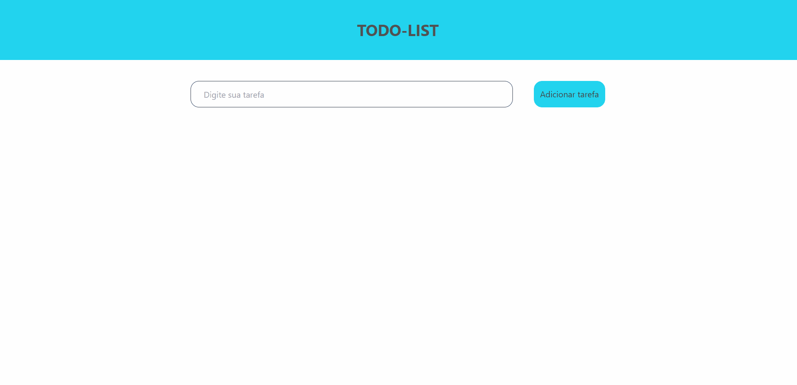
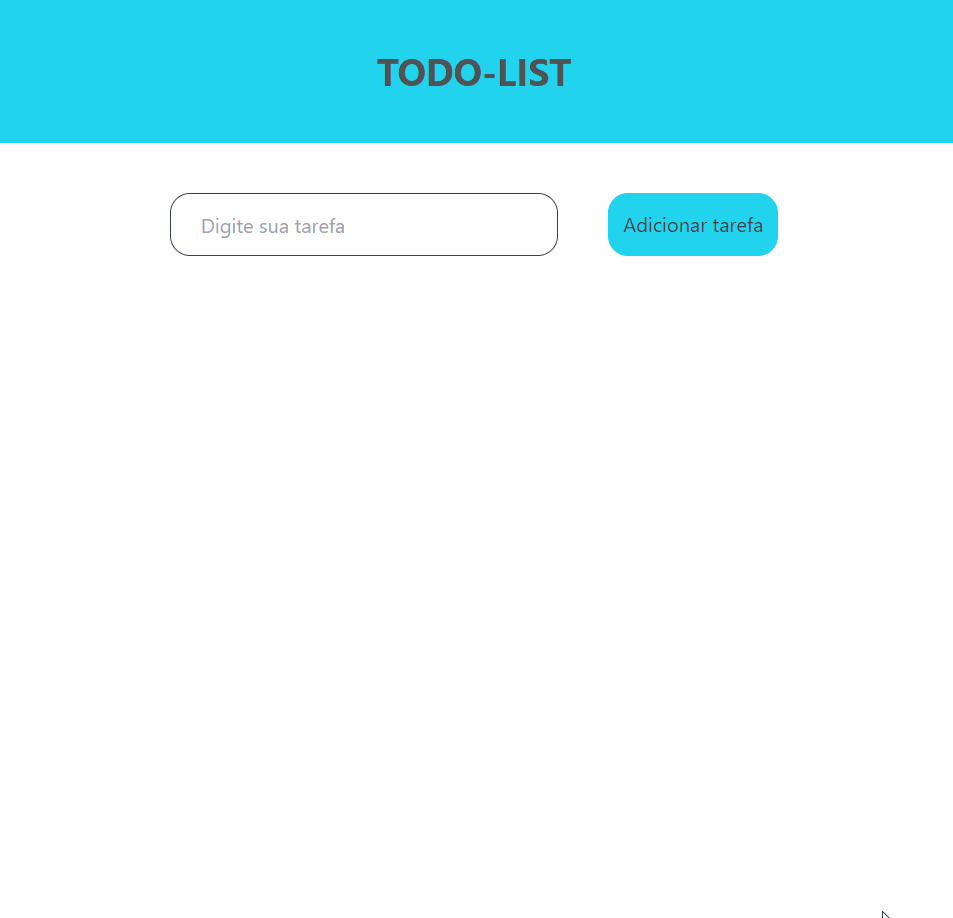

    <h1>Todo-list</h1>

---

 

# Features 🪐

- [x] Todo-list feito com ReactJS, Typescript e TailwindCSS  

---

# Tecnologias utilizadas

- [x] Typescript
- [x] ReactJs
- [x] TailwindCSS
- [x] React-hooks
- [x] React-reveal

 

# Demo Desktop 📷

<h1 align = "center">
    
</h1>

# Demo Tablet 📷

<h1 align = "center">
    
</h1>

# Demo Smartphone 📷

<h1 align = "center">
    
</h1>

 

# Feito com ❤️ por Fabio Del Col Matiusso
